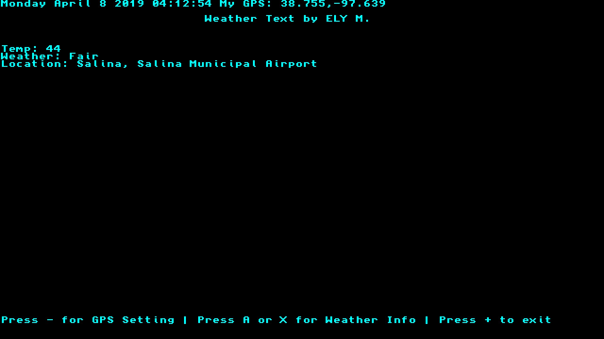

# Weather Text for Nintendo Switch

This weather homebrew app only get you weather info like Temp or Condition.  

you need to set your GPS in the setting by press - button.
It is important to not leave any spaces.  It must be like this 
40.1231,-90.3001

Press A or X to get weather info.  

Press + to exit to homebrew menu.   

Video of the app:
https://youtu.be/PKXBlZfqALM

Thanks/Credit to:  
https://github.com/switchbrew for Switch dev stuff
https://github.com/Dontwait00/nXDownload for download functions     
https://github.com/zserge/jsmn for JSON library